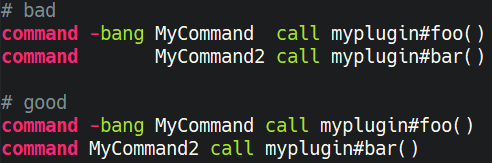
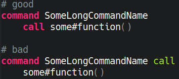
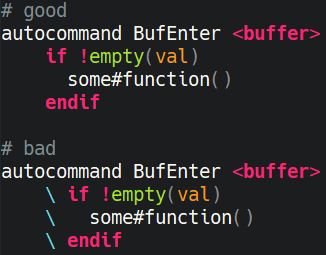

# Vim9 Script Style Guide
## Introduction
This is inspired by [Google's Vimscript Style Guide](https://google.github.io/styleguide/vimscriptfull.xml). Similar to the original guide this is a casual version of the Vim9 Script style guide. When submitting vim plugin code, you must adhere to these rules.

## Style Guide

### Tabs or Spaces?
Use only spaces for indentation. No hard tabs.

### Indentation
Use two spaces per indentation level (aka soft tabs).
```
# bad - four spaces
def method()
    do_something()
enddef

# good
def method
  do_something
enddef
```

### No Trailing Whitespace
Avoid trailing whitespace.

### Line Endings
Use Unix-style line endings.

> [!TIP]
> If you're using Git you might want to add the following conifg setting to protect from Windows line endings creeping in:
>
> `git config --global core.autocrlf true`

### Don't waste whitespace aligning common segments.
It is both difficult and expensive to maintain.



### Prefer line continuations on semantic boundaries.
Avoid arbitrary line continuations and aim for clear semantic boundaries.



### Don't use backslash to denote a line continuation.
This is an old legacy vimscript habit that is no longer required.



### Built-in Functions
- Prefer long names of built ins. (i.e. `tabstop` over `ts`)

## Naming Conventions

### English for Identifiers
Name identifiers in English.

### Camel Casee for Functions
Use `CamelCase` for function definitions. Keep acronyms like HTTP, RFC, XML uppercase.
```
# bad
def Specialfunction
enddef

def Special_Function
enddef

def XmlSomething
enddef

# good
def SpecialFunction
enddef

def XMLSomething
enddef
```
### Snake Case for Variables
Use `snake_case` for variables.

### Identifiers with a Numeric Suffix
Do not separate numbers from letters on variables or functions.
```
# bad
var special_var_1 = 1

def some_method_1
  # some code
enddef

# good
var special_var1 = 1

def some_method1
  # some code
enddef
```

### Snake Case for Files
Use `snake_case` for naming files, e.g. `hello_world.vim`.

### Snake Case for Directories
Use `snake_case` for naming directories, e.g. `autoload/copilot_chat`.

## Flow of Control
TODO: add info on for loops, etc

## Comments
> Good code is its own best documentation. As you’re about to add a comment, ask yourself, "How can I improve the code so that this comment isn’t needed?". Improve the code and then document it to make it even clearer.
>
> - Steve McConnell

### Rationale Comments
Aim for self-documenting code but when a comment is required, add a comment explaining the rationale behind the code.

### Avoid inline comments.
Where you would use an inline comment, put a line comment on the line above.

### Hash Space
Use one space between the leading `#` character of the comment and the text of the comment.

### No Superflous Comments
Avoid superflous comments.
```
# bad
counter += 1 # Increments counter by one.
```

### Comment Upkeep
Keep existing comments up-to-date. An outdated comment is worse than no comment at all.

### Refactor, Don't Comment
> Good code is like a good joke; it needs not explaination.
>
> - old programmers maxim

### Avoid writing comments to explain bad code.
Refactor the code to make it self-explanatory.

## Comment Annotations
### Annotation Keyword Format
The annotation keyword is followed by a colon and a space, then note describing the problem
```
# good
def bar
  # FIXME: This crashes occasionally since v1.2.3 
```

### TODO
Use `TODO` to note missing features or functionality that should be added at a later date.

### FIXME
Use `FIXME` to note broken code that needs to be fixed.

### OPTIMIZE
Use `OPTIMIZE` to note slow or inefficient code that may cause performance problems.

### HACK
Use `HACK` to note code smells where questionable coding practices were used and should be refactored away.

### REVIEW
Use `REVIEW` to note anything that should be looked at to confirm it is working as intended. For example: `REVIEW: Are we sure this is how the client does X currently?`

### Annotation Placement
Annotations should usually be written on the line immediately above the relevant code.
```
# bad
def bar
  do_thing() # FIXME: This crashes occasionally since v1.2.3
enddef

# good
def bar
  # FIXME: This crashes occasionally since v1.2.3
  do_thing()
enddef
```

## Strings
### Prefer single quoted strings.
In order of precedence:
- Always use single quotes for regular expressions
  - `'\s*'` is not the same as `"\s*"`
  - Single quotes will prevent the need for excessive backslashes.
  - Double quotes escape to one single quote in single quoted strings: `'example('')'` represents the string `example(')`
- If your string requires escaped characters (`\n`, `\t`, etc) use double quotes.
  - Escapes can not be expressed in single quoted strings.
  - Remember that `'\n'` in regex does not represent a newline, but rather `"\n"`. You only need to use double quotes when you want to embed the represented character itself (e.g. a newline) in the string.
 - If your string contains no escapes nor single quotes, use single quoted strings.
- If your non-regex string contains single quotes but no double quotes, use double quotes.
### String Interpolation
Use `$'{expression}'` string interpolation instead of `..` when possible.
```
var val = 9
# bad
echo "The square root of {" .. val .. "} is " .. sqrt(val)

# good
echo $"The square root of {{val}} is {sqrt(val)}"
```

## Documentation
Write documentation in .vim files in conformance with vimdoc standards.

## Tools
Here are some tools to help you automatically check Ruby code against this guide.

### Vinter
[vinter](https://github.com/DanBradbury/vinter) is a Vim9 Script linter based on this style guide.

## Contributing
The guide is still a work in progress.

Nothing written in this guide is set in stone. It's our desire to work together with everyone interested in Vim9 Script coding style, so that we could create a resource that will be beneficial to the entire community.

Feel free to open tickets or send pull requests with improvements. Thanks in advance for your help!