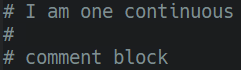

# Vim9 Script Style Guide
## Introduction
This is inspired by [Google's Vimscript Style Guide](https://google.github.io/styleguide/vimscriptfull.xml). Similar to the original guide this is a casual version of the Vim9 Script style guide. When submitting vim plugin code, you must adhere to these rules.

## Style Guide

### Tabs or Spaces?
Use only spaces for indentation. No hard tabs.

### Indentation
Use two spaces per indentation level (aka soft tabs).
```
# bad - four spaces
def method()
    do_something()
enddef

# good
def method
  do_something
enddef
```

### No Trailing Whitespace
Avoid trailing whitespace.

### Line Endings
Use Unix-style line endings.

> [!TIP]
> If you're using Git you might want to add the following conifg setting to protect from Windows line endings creeping in:
>
> `git config --global core.autocrlf true`

### Don't waste whitespace aligning common segments.
It is both difficult and expensive to maintain.


#### Line Continuations
- Prefer line continuations on semantic boundaries.


- Don't use backslash to denote a line continuation.


#### Comments
- Place a space after the `#` before the comment text.
- Do not use inline comments.
  - Where you would use an inline comment, put a line comment on the line above.
- When leaving blank lines in comments, include the `#` in the blank line.



### Strings
Prefer single quoted strings. Specifically, in order of precedence:
- Always use single quotes for regular expressions
  - `'\s*'` is not the same as `"\s*"`
  - Single quotes will prevent the need for excessive backslashes.
  - Double quotes escape to one single quote in single quoted strings: `'example('')'` represents the string `example(')`
- If your string requires escaped characters (`\n`, `\t`, etc) use double quotes.
  - Escapes can not be expressed in single quoted strings.
  - Remember that `'\n'` in regex does not represent a newline, but rather `"\n"`. You only need to use double quotes when you want to embed the represented character itself (e.g. a newline) in the string.
 - If your string contains no escapes nor single quotes, use single quoted strings.
 - Most strings in vimscript are regexes, so this provides maximum consistency.
-  If your non-regex string contains single quotes but no double quotes, use double quotes.
  - Don't bother escaping strings if you don't have to.
- If your string contains both single and double quotes, use whichever quoting style requires less escaping.
  - Break ties in favor of single quotes.

### Built-in Functions
- Prefer long names of built ins. (i.e. `tabstop` over `ts`)

## Documentation
Write documentation in .vim files in conformance with vimdoc standards.
